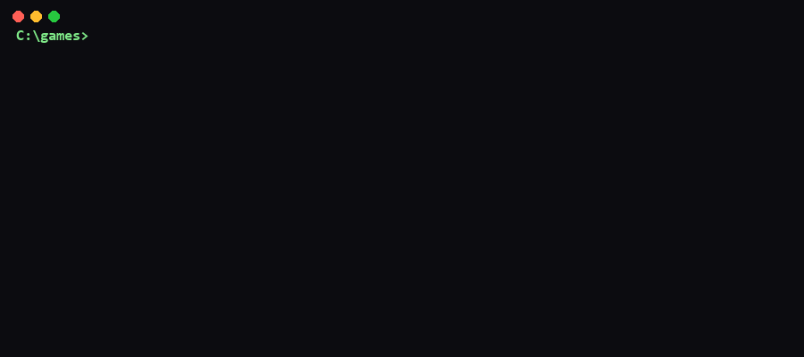
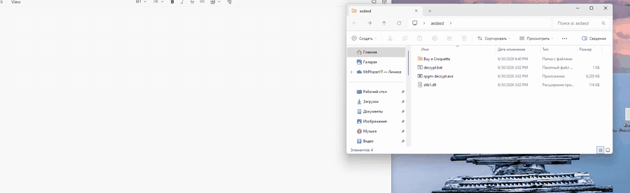

<div align="center">

# 🗝️ rpgm-decrypt

### One small binary that unlocks the assets out of any RPG Maker game.

**XP · VX · VX Ace · MV · MZ** — all five engine generations, one command, no install.


</div>

---

## ⚡ See it work

<div align="center">
  
</div>

```console
$ rpgm-decrypt ./MyGame ./decrypted

[key]  found encryptionKey in www/js/System.json
  +  Title.png_   detected as MV
  >  Title.png_   ->  decrypted/www/img/Title.png   [MV]
  +  Battle.ogg_  detected as MV
  >  Battle.ogg_  ->  decrypted/www/audio/Battle.ogg [MV]
  ...

=== summary ===
scanned:      1873
decrypted:    1869
failed:          0
key source:   www/js/System.json
duration:     4.2s
by format:    MV=1869
```

Need machine-readable output for a script? Add `--report-format json`:

```json
{
  "scanned": 1873,
  "decrypted": 1869,
  "failed": 0,
  "key_source": "www/js/System.json",
  "per_format": { "MV": 1869 },
  "duration_s": 4.2
}
```

> [!TIP]
> **You don't install anything.** Download one file, run it. No Python, no .NET, no
> Node — the binary carries everything it needs inside.

> [!IMPORTANT]
> **Use it on content you're allowed to touch.** Recovering *your own* assets, a
> lost encryption key, an authorized translation, or game preservation — all fine.
> Decrypting someone else's work to steal it is not. The license is permissive;
> your responsibility isn't.

---

## ✨ What you get

| | Feature | In plain words |
|---|---|---|
| 🧩 | **All 5 formats** | `.rgssad` / `.rgss2a` / `.rgss3a` (XP/VX/VX Ace) **and** MV/MZ (`.png_`, `.ogg_`, `.rpgmvp`, `.pak`) — one tool, not five. |
| 🔑 | **Finds the key for you** | Reads `System.json` / scans `rpg_core.js` automatically. No key to hunt down by hand. |
| 📦 | **One self-contained binary** | Copy it to a clean machine and it just runs. Zero dependencies. |
| 🛡️ | **Safe by construction** | Hostile/corrupt input never crashes it (proven by fuzzing) and can't escape your output folder (Zip-Slip blocked). |
| 🤖 | **Script-friendly** | `--report-format json` + NDJSON logs pipe straight into `jq`. |
| 🧪 | **Provably correct core** | Key functions carry formal contracts (Gospel); core safety properties are machine-checked (Why3 / Z3). |

---

## 🚀 Quick start

**1. Download** the binary for your OS from the [Releases](../../releases) page.

**2. Run it** on a game folder:

```bash
# simplest form — output goes next to the game folder
rpgm-decrypt ./MyGame

# pick your own output folder
rpgm-decrypt ./MyGame ./decrypted

# look but don't write anything (see what it WOULD do)
rpgm-decrypt ./MyGame --dry-run
```

That's it. Point it at the game, get a clean mirror tree of decrypted files out.

### 🪟 Easiest way on Windows (no terminal)

Not comfortable with the command line? The Windows download includes a small
helper, **`decrypt.bat`**:

1. Download `rpgm-decrypt-windows-x64.zip` and **extract the whole folder**
   (keep `rpgm-decrypt.exe`, `zlib1.dll` and `decrypt.bat` together).
2. **Drag your game folder onto `decrypt.bat`.**
3. Done — the decrypted files appear in a new folder next to your game, named
   `<your-game>-decrypted`.

No install, no typing. (`zlib1.dll` is just the standard compression library
Windows needs to read `.pak` archives — keep it next to the `.exe`.)

<div align="center">
  
</div>

---

## 🔑 How it finds the key (no flags needed)

When you don't pass a key, rpgm-decrypt looks for it the way the engine stores it:

```text
1.  www/js/System.json   →  read "encryptionKey"   (the normal case)
2.  www/data/System.json →  same, alternate layout
3.  www/js/rpg_core.js   →  extract the 32-hex key literal (never runs the JS)
4.  *.js sweep           →  last resort, scan every script for the key
```

> [!NOTE]
> Can't find it automatically (custom build, stripped files)? Hand it the key:
> ```bash
> rpgm-decrypt ./MyGame --password deadbeef00112233445566778899aabb
> rpgm-decrypt ./MyGame --password-file keys.txt      # try a list, first match wins
> rpgm-decrypt ./MyGame --vxace-seed 1a2b3c4d          # RPG Maker VX Ace
> ```

---

## ⚙️ Options

| Flag | Default | What it does |
|---|---|---|
| `--password <hex32>` | — | One key, 32 hex chars (16 bytes). |
| `--password-file <path>` | — | Newline-separated candidate keys; first that works wins. |
| `--vxace-seed <8hex>` | — | RPG Maker VX Ace master-seed, instead of an auto key. |
| `--log-format human\|json` | `human` | Per-file progress on stderr (`json` = one NDJSON event per line). |
| `--report-format human\|json` | `human` | Final summary on stdout. |
| `--dry-run` | off | Walk + detect + classify, but write **nothing**. |
| `--quiet` | off | Hide per-file progress, show only the summary. |
| `-h`, `--help` | — | Show help. |
| `--version` | — | Version + supported formats. |

### Exit codes

| Code | Meaning |
|:---:|---|
| `0` | ✅ Everything decrypted. |
| `2` | ⚠️ Usage error (bad args). |
| `3` | 💽 I/O error (can't read input / write output). |
| `4` | 🔑 No key could be recovered. |
| `5` | 🟡 Partial — at least one file failed (details in the report). |

---

## 🏗️ Built like it matters

Most decrypters are a quick script. This one is engineered as a real product —
that's the part a senior engineer notices:

| Discipline | What it means here |
|---|---|
| 🧬 **Pure functional core** | Narrow `.mli` per module, 72 behavioural checks + 12 QCheck property tests, mutation-tested (7/7 mutants killed). |
| 💥 **Fuzzed against chaos** | **21M+** mutated/garbage inputs, **0 crashes** — plus coverage-guided `afl-fuzz` in CI. It does not fall over on broken files. |
| 📐 **Property-based tests** | Invariants, not examples: *"XOR is its own inverse for any key & data"*, *"a path can never escape the output root"*. |
| 🔒 **Formally verified core** | The parser carries **Gospel** contracts; its key safety properties — bounds, little-endian decode, and the no-path-escape (Zip-Slip) invariant — are **machine-checked by Why3 / Z3**. ([details](ocaml/README.md#formal-verification--guarantees)) |
| 🧹 **Zero-warning, formatted, clean-room** | Builds warning-as-error, `ocamlformat`-canonical, Apache-2.0, no decompiled code. |
| 🔁 **CI on every push** | Linux + Windows build/test, security scanners (SAST, Secret scanning), fuzzing, verification. |

> [!CAUTION]
> The decrypter is built for **robustness on adversarial input** on purpose: it parses
> file formats produced by *other* programs, so it treats every byte as untrusted.
> That's why the parser is fuzzed *and* formally verified rather than just "tested".

---

## 📊 Test & verification reports

### Code coverage

-yellow)

Generated by **bisect_ppx** (OCaml's coverage tool) over the 72 behavioural
checks + 12 QCheck properties. The numbers split cleanly into two tiers: the
**pure core** (the actual decryption logic) is 80–100% covered, while the
**I/O modules** that talk to the disk/JSON/regex sit at 36–41%.

| File | Coverage | Covered / Total |
|---|---:|---:|
| `lib/vxace_key.ml` | **100.0%** | 35 / 35 |
| `lib/io.ml` | **100.0%** | 4 / 4 |
| `lib/crypto.ml` | 95.4% | 104 / 109 |
| `lib/rgssad_core.ml` | 87.9% | 58 / 66 |
| `lib/walk.ml` | 81.1% | 30 / 37 |
| `lib/vxace.ml` | 80.4% | 37 / 46 |
| `lib/mv.ml` | 65.3% | 32 / 49 |
| `lib/mz.ml` | 63.0% | 17 / 27 |
| `lib/dispatch.ml` | 58.9% | 53 / 90 |
| `lib/report.ml` | 40.7% | 96 / 236 |
| `lib/key_discovery.ml` | 39.1% | 66 / 169 |
| `lib/types.ml` | 37.5% | 9 / 24 |
| `lib/log.ml` | 36.4% | 24 / 66 |
| `lib/xp.ml` | 33.3% | 1 / 3 |
| `lib/vx.ml` | 33.3% | 1 / 3 |
| **Project** | **58.8%** | **567 / 964** |

> `xp.ml` / `vx.ml` are thin wrappers over `rgssad_core` (one-line `parse`
> functions); their low counts reflect the wrapper delegation, not untested
> logic — the shared parser is 87.9% covered.

<details>
<summary><b>Why the pure core is 80–100% but I/O is 36–41% (in plain words)</b></summary>

Think of the tool in two layers:

- **The pure core** — the actual decryption: XOR math, key derivation, the
  archive parsers, the file-format classifiers. This is pure logic: bytes in,
  bytes out, no disk, no network. It is exactly what the test suite exercises
  (72 behavioural checks + 12 property tests feed it thousands of crafted
  inputs in-process), so it ends up **80–100% covered**. This is the part that
  *must* be correct — and it is the part that is also fuzzed and formally
  verified.

- **The I/O modules** — `report.run` (walks the game folder, writes the
  decrypted mirror tree), `key_discovery` (reads `System.json`, scans
  `rpg_core.js`), `log` (formats output). These only do real work when pointed
  at an *actual* RPG Maker game on disk — hundreds of files, real JSON, real
  directory structures. That kind of load can't run inside the in-process test
  suite, and we deliberately **do not commit real game files** into the repo
  (licensing cleanliness — see `CONTRIBUTING.md`). So the suite exercises only
  the fast/synthetic paths of these modules, leaving their full end-to-end
  branches uncounted. Hence **36–41%**.

This is not a gap in the *decryption* correctness — the core that does the
decrypting is nearly fully covered, fuzzed, and proven. It is a measurement
artifact: the I/O layer's real workload needs real games, which live outside
the repo. A CI run against a real (private, sanitized) game fixture would lift
these numbers; it is just not something we keep in version control.

</details>

Full browsable report: [`ocaml/coverage/html/index.html`](ocaml/coverage/html/index.html) ·
machine-readable: [`ocaml/coverage/coverage.cobertura.xml`](ocaml/coverage/coverage.cobertura.xml) ·
raw summary: [`ocaml/coverage/summary.txt`](ocaml/coverage/summary.txt).

<details>
<summary><b>How coverage is generated</b></summary>

```bash
opam install bisect_ppx            # OCaml ≤ 5.3 (use a separate switch on 5.5)
cd ocaml
dune build --instrument-with bisect_ppx --force test/test.exe test/prop/prop.exe
BISECT_FILE=$PWD/_build/cov dune exec --instrument-with bisect_ppx --force test/test.exe
BISECT_FILE=$PWD/_build/cov dune exec --instrument-with bisect_ppx --force test/prop/prop.exe
bisect-ppx-report summary --per-file _build/*.coverage
bisect-ppx-report cobertura coverage.cobertura.xml _build/*.coverage
bisect-ppx-report html _build/*.coverage -o coverage/html
```

The `ocaml-coverage` GitLab CI job (`when: manual`) reproduces this and
exposes the report as a downloadable artifact. bisect_ppx 2.8.x emits
`html` / `cobertura` / `coveralls` / `summary` (it dropped native LCOV
output; Cobertura XML is the machine-readable interchange format here).

</details>

### Mutation testing


A directed smoke campaign: 7 single-edit mutants on the verified core, each
rebuilt and run against the 72 behavioural checks + 12 QCheck properties.
First wave found 2 real coverage gaps (high bytes of `read_u32_le`, the
`ogg` extension map); after targeted test additions, **all 7 are killed**.

| # | Mutant | Result |
|---|---|---|
| M1 | `crypto`: xor key index `i mod klen` → `i mod (klen+1)` | 🔴 killed |
| M2 | `crypto`: xor output size `n` → `n+1` | 🔴 killed |
| M3 | `vxace_key`: `derive_master_key` `+3` → `+4` | 🔴 killed |
| M4 | `rgssad_core`: `read_u32_le` byte1 `lsl 8` → `lsl 16` | 🔴 killed |
| M5 | `report`: `safe_join` `full = root` → `full = full` | 🔴 killed |
| M6 | `dispatch`: `choose_output_extension` `png` → `.pngx` | 🔴 killed |
| M7 | `dispatch`: `choose_output_extension` `ogg` → `.png` | 🔴 killed |

Full report with the survivor analysis and the test additions that closed the
gaps: [`ocaml/MUTATION_REPORT.md`](ocaml/MUTATION_REPORT.md).

---

## 🔧 Build from source

<details>
<summary><b>OCaml (flagship — single native binary)</b></summary>

```bash
cd ocaml
dune build --profile release
./_build/default/bin/main.exe --version
```

For a portable, statically-linked Linux binary, build on Alpine (musl) with
`dune build --profile static`.

</details>

<details>
<summary><b>Run the tests</b></summary>

```bash
# OCaml: 72 behavioural checks + 12 QCheck property tests
cd ocaml && dune exec --profile release test/test.exe

# QCheck properties (needs `opam install qcheck`)
cd ocaml && dune exec --profile release test/prop/prop.exe
```

Test fixtures are generated synthetically at test time — we never commit real
RPG Maker game bytes, to keep the repo licensing-clean.

</details>

<details>
<summary><b>Project layout</b></summary>

```text
ocaml/                  OCaml flagship — single native binary
  lib/                    pure core + narrow .mli (Gospel specs)
  bin/                    CLI front-end
  test/  test/prop/       behavioural checks + QCheck properties
  fuzz/                   afl-instrumented fuzz target
  proofs/                 Why3 + Z3 deductive verification (Zip-Slip, bounds)
  coverage/               bisect_ppx coverage report (HTML + Cobertura XML)
  MUTATION_REPORT.md      mutation testing campaign (7/7 killed)
.gitlab-ci.yml          test + fuzz + verification farm
.github/workflows/      tag-triggered release builds
```

</details>

---

## 📜 License

**Apache-2.0** — free to use, modify, and ship. See [`LICENSE`](LICENSE).

Clean-room implementation: built from public format documentation and community
wikis, no decompiled engine code. Every magic-byte constant is cited in the source.

---

<div align="center">

**Found a game it can't crack?** [Open an issue](../../issues) with the game layout and the
failing file — real bugs get fixed.

<sub>Built turn-key, spec-to-shipped. Every claim here is backed by a test, a fuzz run, or a proof.</sub>

</div>
